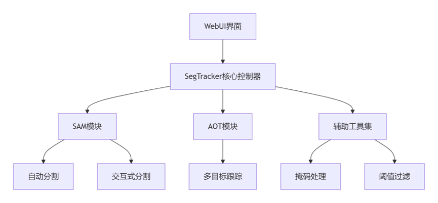

# 基于SAM和DeAOT的视频隐私自动打码系统

> 学习实践项目 | 2025.06

## 项目简介

针对短视频与直播爆发式增长带来的隐私泄露问题，基于 **SAM（Segment Anything Model）** 和 **DeAOT（Decoupling features in Associating Objects with Transformers）** 实现视频自动打码。

**核心解决**：传统人工打码效率低、动态跟踪易丢失、粗粒度易被AI还原。

---

## 技术架构

| 模块 | 功能 |
|------|------|
| WebUI界面 | 用户上传视频、选择交互方式、预览结果 |
| SegTracker核心控制器 | 协调SAM与DeAOT，管理分割-跟踪流水线 |
| SAM模块 | 首帧自动/交互式分割，生成掩码 |
| AOT模块 | 跨帧多目标跟踪，掩码传播 |
| 辅助工具集 | 掩码处理、阈值过滤、马赛克渲染 |

---

## 核心功能

| 功能 | 说明 |
|------|------|
| 🔍 自动分割 | SAM网格采样自动识别潜在敏感目标 |
| 👆 点击选择 | 用户点击指定特定目标 |
| ✏️ 画笔绘制 | 自定义区域精细分割 |
| 📝 文本提示 | 输入"人脸""车牌"等自动匹配（GroundingDINO）|
| 🎯 动态跟踪 | DeAOT跨帧ID追踪，遮挡恢复 |
| ↩️ 智能回滚 | 任意帧修正，增量重新传播 |

---

## 我的学习与参与

### 1. 技术理解
- 梳理SAM与DeAOT的协同机制：SAM负责"分割准"，DeAOT负责"跟得住"
- 理解关键参数作用：`sam_gap`控制检测频率，`points_per_side`影响分割粒度

### 2. 文档与实践
- 汇总技术资料，整理参数调优说明
- 本地部署运行WebUI，测试四种交互模式
- 观察不同参数组合对速度和精度的影响

### 3. 关键发现
| 参数组合 | points_per_side | sam_gap | 效果 |
|---------|----------------|---------|------|
| 高速模式 | 16 | 20 | 速度提升约70%，小目标易漏 |
| 精度模式 | 32 | 5 | 分割精度98%，但计算量大 |

---

## 应用场景

- 📱 短视频/直播隐私保护
- 🎥 媒体内容审核与脱敏
- 🏥 医疗影像患者信息保护
- 🚗 自动驾驶数据标注脱敏

---

## 技术栈

`Python` `PyTorch` `OpenCV` `SAM` `DeAOT` `GroundingDINO` `Gradio`

---

> 💡 基于 [SAM-Track](https://github.com/SysCV/sam-track) 开源框架进行学习实践。
